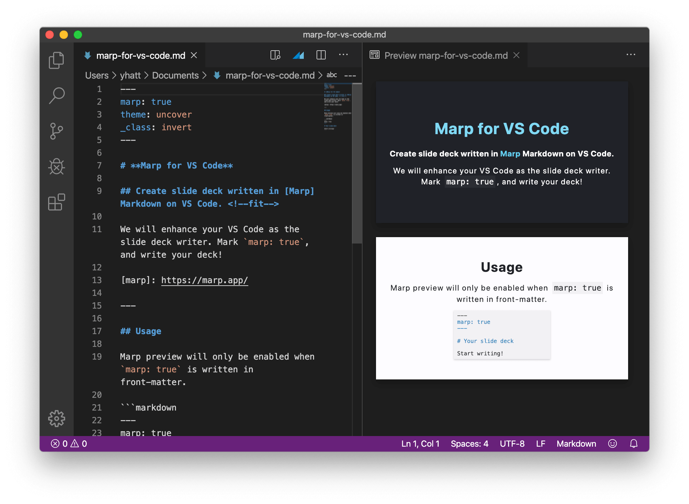
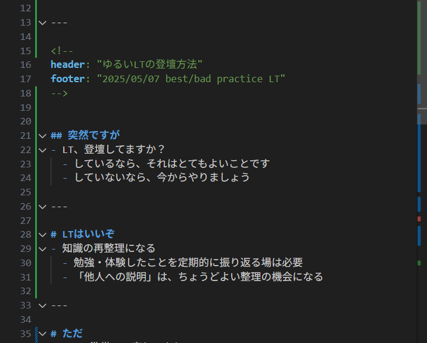

<!-- 
header: ""
footer: ""
-->
# ゆるいLTの登壇方法
yotu

---

<!-- 
footer: "2025/05/07 best/bad practice LT"
-->

## 突然ですが
- LT、登壇してますか？
  - しているなら、それはとてもよいことです
  - していないなら、今からやりましょう

---

## LTはいいぞ
- 知識の再整理になる
  - 勉強・体験したことを定期的に振り返る場は必要
  - 「他人への説明」は、ちょうどよい整理の機会になる

---

## ただ
- LT の準備って疲れるよね
  - 内容をまとめるだけでもけっこう大変なのに
  - スライドに画像とか挿絵とか入れてたら日が暮れる

---

## 実際どれくらいかかってる？
- [この前のLTスライド（雑め）](https://www.canva.com/design/DAGkKHBEWh0/bChpqmUzLSZnZTiGWodQkA/edit?utm_content=DAGkKHBEWh0&utm_campaign=designshare&utm_medium=link2&utm_source=sharebutton)

---

## 実際どれくらいかかってる？
- [学校で作ったスライド（しっかりめ）](https://www.canva.com/design/DAGl_9VhnCo/wbmcYimHq2VHFpTJHrmF7A/edit?utm_content=DAGl_9VhnCo&utm_campaign=designshare&utm_medium=link2&utm_source=sharebutton)

---

## もっと楽に資料を作る
- もっとサクッとスライドを作りたい！
  - テキスト形式でスライドを書ければ楽なんじゃね？

---

## もっと楽に資料を作る
- [Marp](https://marp.app/)
  - Markdown でスライドが作れる、イイ感じのツール

---

## もっと楽に資料を作る
- このスライドも、Marp で書いています
  - ちなみに今回初めて使いました

---

## LT ってもっと雑でいいんすよ
- 自分の気づきを発表する場なので、資料は適当でいい
  - 「主張」ではなく「共有」だと思って話すとよいです
  - なくても最悪いけます

---

## 雑に作る
- 最近気づいたことを、一行でまとめる（タイトル）
  - それに合わせてイイ感じに内容を広げる
  - 最後にそれっぽいまとめをいえば完璧！

---

# まとめ
### LT、やろう！
###### （このあとの飛び入り登壇も歓迎ですよ！！！！！）