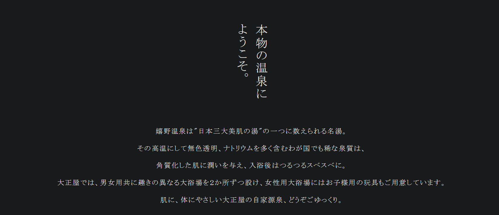

---
marp: true
theme: "gaia"
header: ""
footer: ""
backgroundColor: white
headingDivider: 1
paginate: true
size: 16:9
math: katex
--- 
<!-- _class: lead -->
# 嬉野について語る
## ～温泉編～
yotu

# 自己紹介
- よつ（yotu）
  - 22歳, 26卒
  - 趣味：ランニング、小旅行
  - 出身：佐賀、嬉野

# きょう喋ること
- 我が地元、嬉野について語ります
  - すべて語ると長くなるので
  - 今回は温泉の話に絞っていきます

# 嬉野って？
- 佐賀の南西に位置する盆地の町です

# 何が有名なの？
- お茶

# 何が有名なの？
- 温泉
- お茶（嬉野茶）
- 焼き物（吉田焼・志田焼）

# 何が有名なの？
- 温泉
  - 「日本三大美肌の湯」と呼ばれています

# 何が有名なの？
- お茶（嬉野茶）
  - 独特な丸みのある玉緑茶
  - 香ばしく、煎が効く釜炒り製が多い

# 何が有名なの？
- 焼き物（吉田焼・志田焼）
  - 江戸から続く、天草陶石を使った磁器
  - 4月頭に開催される「おやまさん陶器祭り」も有名

# 嬉野温泉について
- 以下の順番でしゃべります
  - 特徴
  - おススメの温泉など

# 特徴
- ツルツル、スベスベ
  - メリット　：肌にめちゃくちゃいい
  - デメリット：気を抜くとコケる

# 特徴
- あつい
  - 高温泉（85~90度）に分類
  - 割と熱めの温泉が多い（きがする）

# おススメの温泉
- 前提
  - 3つピックアップ
  - 日帰り入浴ができるとこのみ
  - 銭湯は含みません
    - 地元の人が多いので観光には適さないかも...

# おススメの温泉
- 本命：[大正屋](https://www.taishoya.com/)
  - 長崎街道（嬉野の中心）にあるホテル
  - 入浴料：1,300円（大人）

# おススメの温泉
- 大正屋HP（自信がすごい）

# おススメの温泉
- 対抗：[大村屋](https://www.oomuraya.co.jp/)
  - 嬉野川沿いにある旅館
  - 入浴料：1,100円（大人）

# おススメの温泉
- 貸し切りサウナがあるらしいです
  - 入浴料：5,500円（大人）

# おススメの温泉
- 大穴：椎葉山荘
  - 山中にある大正屋の別荘（マジで遠い！！！）
  - 車 or 無料送迎があります（要事前予約）

# おススメの温泉
- ちなみに
  - 大正屋・椎葉山荘に泊まると、両方の温泉を利用できる
    - とてもオススメ！

# おわりに
- GW に嬉野旅行はいかがですか？
